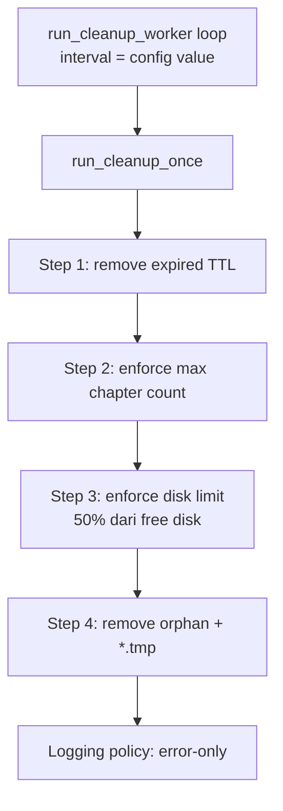

# Flow Mirror Komiku

Format di bawah sengaja pakai Mermaid (bukan gambar statis), jadi lebih fleksibel saat viewport kecil dan tetap mudah di-update.

## 1) User Request Flow

```mermaid
flowchart TD
    A[User Browser<br/>request /mirror/{target}] --> B[Actix HTTP Handler]
    B --> C[Decode + Validate URL<br/>SSRF Guard]
    C --> D[chapter_hash = hash(url)]
    D --> E{Cache page exists?}

    E -->|yes| F{meta.expires_at > now?}
    F -->|yes| G[Serve HTML cache<br/>x-cache-status: HIT]
    F -->|no| H[Serve stale HTML<br/>x-cache-status: STALE]
    H --> I[Spawn background regenerate]

    E -->|no| J{try_begin_generation?}
    J -->|yes| K[Live pipeline start]
    K --> L[Return live HTML<br/>x-cache-status: MISS_STREAMING<br/>3 raw image dulu]
    L --> M[Background generate chapter]
    I --> M

    M --> N[Fetch HTML + Parse images]
    N --> O[Convert AVIF + Write index.html/meta.json]
    O --> P[WS event: image_avif / chapter_done]
    P --> Q[Prefetch next chapters]
```

### Ringkasan Mobile (tanpa diagram)

1. Request masuk ke handler `/mirror/{target}`.
2. URL di-decode, divalidasi, lalu kena guard SSRF.
3. Server hitung `chapter_hash`.
4. Jika cache ada dan masih fresh, langsung kirim HTML cache (`HIT`).
5. Jika cache ada tapi expired, kirim stale (`STALE`) dan regen di background.
6. Jika cache belum ada, coba lock generation.
7. Jika lock didapat, kirim live HTML (`MISS_STREAMING`) dengan 3 image raw dulu.
8. Background pipeline lanjut: fetch, parse, convert AVIF, write cache, kirim event WS, lalu prefetch.

## 2) Cleanup Worker Flow



### Ringkasan Mobile (tanpa diagram)

1. Worker jalan sesuai interval config.
2. Tiap siklus, cleanup jalankan 4 step berurutan: expired, max count, disk limit, orphan/temp.
3. Log hanya saat gagal (tanpa log info/success).
